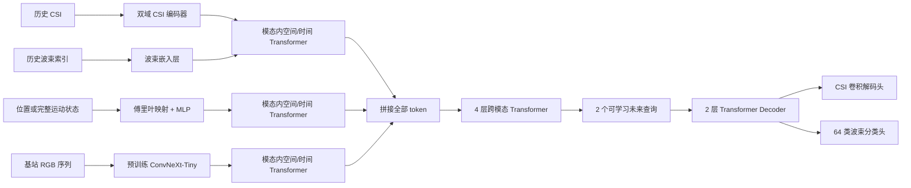

# 多模态 CSI 与波束预测网络技术说明

本文档面向当前 `simart-m2stformer` 实现，重点解释网络实际接收什么数据、各编码器如何改变张量维度、模态如何完成时空建模与融合，以及 CSI 和波束预测头如何产生未来两步结果。文中的尺寸、层数和训练设置均来自服务器上的现有代码与配置，而不是概念性示意。

相关实现位于服务器目录：

- 模型主体：`/root/autodl-tmp/simart-m2stformer/src/simart_m2stformer/model.py`
- 数据读取与预处理：`/root/autodl-tmp/simart-m2stformer/src/simart_m2stformer/data.py`
- 损失函数与指标：`/root/autodl-tmp/simart-m2stformer/src/simart_m2stformer/losses.py`
- 训练流程：`/root/autodl-tmp/simart-m2stformer/train_one.py`
- CSI 配置：`/root/autodl-tmp/simart-m2stformer/configs/train_4090d.yaml`
- 5 Hz 波束配置：`/root/autodl-tmp/simart-m2stformer/configs/train_beam_5hz.yaml`

## 1. 网络解决的两个任务

同一个多模态时空 Transformer 骨干服务于两个任务，任务之间的主要区别是无线编码器、输出头和损失函数。

| 项目 | 完整 CSI 预测 | 最优波束预测 |
| --- | --- | --- |
| 历史无线输入 | 8 帧复数 CSI | 8 个最优波束索引 |
| 无线输入尺寸 | `[N, 8, 2, 64, 128]` | `[N, 8]` |
| 预测步数 | 2 | 2 |
| 输出尺寸 | `[N, 2, 2, 64, 128]` | `[N, 2, 64]` |
| 输出含义 | 两个未来时刻的实部和虚部 | 两个未来时刻对 64 个波束的 logits |
| 当前采样率 | 20 Hz | 5 Hz |

其中：

- `N` 是批量大小；
- 第一个 `2` 在 CSI 中表示实部和虚部；
- `64` 是 8×8 UPA 展平后的天线维度；
- `128` 是子载波数；
- 波束输出的最后一维不是波束编号，而是 64 个候选波束各自的未归一化分类分数。

## 2. 端到端结构概览



整体流程可以概括为四步：

1. 每种模态使用适合自身数据结构的编码器生成 256 维 token；
2. 每个模态独立进行空间和时间建模；
3. 将所有模态 token 拼接，通过跨模态 Transformer 建立关联；
4. 使用两个可学习查询分别提取未来第 1 步和第 2 步的状态，再交给任务相关输出头。

当前统一隐空间维度为 `d_model = 256`。所有编码器最终都必须输出 256 维 token，这正是异构模态能够进入同一融合网络的前提。

## 3. 输入数据与预处理

每个样本描述一条“指定基站—无人机”链路。模型处理的是单条链路窗口，而不是同时将 9 个基站输入一个网络样本。

### 3.1 CSI

原始复数 CSI 被拆成实部和虚部：

```text
[N, 8, 64, 128] complex
        ↓ 拆分实部和虚部
[N, 8, 2, 64, 128] float
```

实部和虚部使用训练集统计得到的统一复数 RMS 进行缩放。当前 RMS 记录在 `normalization_excluding_bs8.json` 中。输入和预测目标采用相同缩放，因此网络学习的是归一化 CSI；需要恢复原始物理尺度时，应将输出乘回该 RMS。

### 3.2 历史最优波束

波束任务的无线输入是 0–63 的整数索引，尺寸为 `[N, 8]`。它不进行连续数值归一化，而是通过可学习嵌入表转换成向量。

### 3.3 三维位置与完整运动状态

位置输入为：

```text
[x, y, z] → 3 维
```

完整运动状态为：

```text
[x, y, z, vx, vy, vz, qx, qy, qz, qw] → 10 维
```

位置和线速度分别使用训练集均值与标准差进行标准化。四元数首先归一化到单位长度；如果相邻四元数内积为负，则翻转后一项的符号，从而消除 `q` 与 `-q` 表示同一姿态造成的序列跳变。四元数不再进行均值—方差标准化。

### 3.4 RGB

每个样本读取与当前基站对应的历史 8 帧 RGB 图像：

```text
JPEG → RGB → 224×224 → [N, 8, 3, 224, 224]
```

像素先缩放到 0–1，再使用 ImageNet 均值和标准差归一化，以匹配预训练 ConvNeXt-Tiny 的输入分布。

### 3.5 当前没有显式输入的信息

当前网络没有直接接收以下变量：

- 基站编号；
- 载频、子载波间隔和阵列配置；
- 绝对时间戳或相邻帧时间差；
- 地图名称或场景 ID；
- 未来两个目标时刻的运动状态和 RGB。

这些条件在当前固定场景和固定通信配置的数据集中是隐含的。模型在直接预测时只读取历史 8 帧。递归预测进入下一轮后，新获得的运动和 RGB 才会作为新的历史观测进入网络。

## 4. 双域 CSI 编码器

CSI 既可以在天线—频率域中观察，也可以转换到角度—角度—时延域中观察。当前网络并行处理两个域，再用可学习门控进行融合。

### 4.1 角度—角度—时延变换

输入首先从 64 根天线还原为 8×8 UPA：

```text
[N, 8, 2, 64, 128]
        ↓ 实部和虚部组成复数
[N, 8, 8, 8, 128] complex
```

随后执行：

- 在两个 8 维阵列轴上进行二维 FFT，将天线维转换为两个角度维；
- 在 128 个子载波上进行 IFFT，将频率维转换为时延维；
- 对三个变换维执行 `fftshift`；
- 再拆回实部和虚部。

输出尺寸仍为 `[N, 8, 2, 64, 128]`。该变换只改变表示域，不降低信息维度。

### 4.2 两个并行卷积分支

原始 CSI 和角度—角度—时延 CSI 分别进入结构相同、参数独立的卷积分支。每一帧的维度变化如下：

| 层 | 输出尺寸，省略批量与时间维 |
| --- | --- |
| 输入 | `[2, 64, 128]` |
| 5×5 Conv，stride 2 | `[32, 32, 64]` |
| 32 通道残差块 | `[32, 32, 64]` |
| 3×3 Conv，stride 2 | `[64, 16, 32]` |
| 64 通道残差块 | `[64, 16, 32]` |
| 3×3 Conv，stride 2 | `[128, 8, 16]` |
| 128 通道残差块 | `[128, 8, 16]` |

卷积层之间使用 GroupNorm 和 GELU。每个残差块包含两个 3×3 卷积和 GroupNorm，并将输入与卷积结果相加后通过 GELU。

### 4.3 自适应门控融合

两个域的输出都为 `[N×8, 128, 8, 16]`。网络沿通道拼接为 256 通道，再经过 1×1 卷积和 Sigmoid 得到逐位置、逐通道门控权重：

```text
raw feature ────────────────┐
                            ├─ concat → 1×1 Conv → Sigmoid → gate
angle-delay feature ────────┘

fused = gate × raw + (1 - gate) × angle-delay
```

这不是将两个域简单相加。网络可以针对不同样本和局部特征，自适应决定更依赖原始域还是角度—时延域。

### 4.4 CSI token 化

融合特征通过自适应平均池化从 `[128, 8, 16]` 压缩为 `[128, 4, 4]`，再展平为空间 token：

```text
[N, 8, 128, 8, 16]
        ↓ adaptive average pooling
[N, 8, 128, 4, 4]
        ↓ flatten spatial dimensions
[N, 8, 16, 128]
        ↓ LayerNorm + Linear(128 → 256)
[N, 8, 16, 256]
```

因此，每帧 CSI 产生 16 个 token，8 帧共产生 128 个无线 token。

## 5. 波束历史编码器

波束索引通过大小为 `64×256` 的可学习嵌入表编码：

```text
[N, 8] integer indices
        ↓ Embedding(64, 256)
[N, 8, 256]
        ↓ 增加 token 维
[N, 8, 1, 256]
```

每个历史时刻只产生一个波束 token。嵌入层不会假设波束编号之间具有线性距离；编号 10 与编号 11 是否相似，由训练数据决定。

## 6. 位置与运动编码器

低维连续状态先经过傅里叶特征映射，再通过 MLP 投影到 256 维。

当前使用 4 个频带，其频率为 1、2、4 和 8。对每个输入标量，编码器保留原值，并计算四组正弦和余弦，因此一个标量扩展为 9 个数：

```text
x → [x, sin(πx), cos(πx), ..., sin(8πx), cos(8πx)]
```

对应维度为：

| 输入类型 | 原始维度 | 傅里叶映射后 | MLP 输出 |
| --- | ---: | ---: | ---: |
| 仅位置 | 3 | 27 | 256 |
| 完整运动状态 | 10 | 90 | 256 |

MLP 的结构为：

```text
27 或 90
  → Linear(·, 128)
  → GELU
  → LayerNorm(128)
  → Linear(128, 256)
  → GELU
  → Linear(256, 256)
```

最终尺寸为 `[N, 8, 1, 256]`，即每帧产生一个状态 token。傅里叶映射有助于 MLP 表达位置与信道之间可能存在的高频、非线性空间关系。

## 7. RGB 编码器

视觉分支采用 ImageNet 预训练的 ConvNeXt-Tiny，并保留其卷积特征提取部分。每帧的典型维度变化为：

```text
[3, 224, 224]
        ↓ ConvNeXt-Tiny features
[768, 7, 7]
        ↓ adaptive average pooling
[768, 2, 2]
        ↓ flatten
[4, 768]
        ↓ LayerNorm + Linear(768 → 256)
[4, 256]
```

恢复批量和时间维后，视觉编码器输出 `[N, 8, 4, 256]`。因此每帧图像保留 2×2 共 4 个粗粒度空间 token，8 帧共 32 个视觉 token。

ConvNeXt-Tiny 在训练前 10 个 epoch 冻结，之后以 `1e-5` 的学习率微调；其他模块使用 `1e-4`。这种设置先让新加入的融合与预测层适应已有视觉表示，再以较小学习率调整视觉骨干。

## 8. 模态内空间—时间建模

每个已启用的模态都有独立的 `IntraModalSpatioTemporalEncoder`，其参数不在不同模态之间共享。

### 8.1 时间嵌入

编码器先为 8 个历史时刻加入可学习时间嵌入，尺寸为 `[1, 8, 1, 256]`。同一时刻的所有空间 token 使用相同时间嵌入。

### 8.2 空间 Transformer

首先在每一帧内部沿 token 维进行自注意力：

```text
[N, 8, K, 256]
        ↓ 合并 N 与时间维
[N×8, K, 256]
        ↓ 1 层空间 Transformer
[N×8, K, 256]
```

其中 `K` 对 CSI、RGB、运动和波束分别为 16、4、1 和 1。对于只有一个 token 的状态或波束分支，空间自注意力不会建立多个位置之间的关系，但其中的前馈网络、归一化和残差连接仍会继续变换特征。

### 8.3 时间 Transformer

随后固定 token 的空间位置，沿 8 个时刻进行自注意力：

```text
[N, 8, K, 256]
        ↓ 调整维度
[N×K, 8, 256]
        ↓ 2 层时间 Transformer
[N×K, 8, 256]
        ↓ 恢复维度
[N, 8, K, 256]
```

这一阶段学习历史序列的演化规律。对 CSI 和 RGB 而言，同一池化网格位置在不同帧之间形成时间序列；对运动和波束而言，唯一 token 直接形成长度为 8 的时间序列。

空间和时间 Transformer 均采用：

- 256 维特征；
- 8 个注意力头，每个头 32 维；
- 1024 维前馈层；
- GELU；
- 0.1 dropout；
- pre-norm 结构。

当前实现显式加入了时间嵌入和模态嵌入，但没有在池化后的 CSI 或 RGB token 上额外加入二维位置嵌入。前置卷积网络能够提取局部空间模式，时间 Transformer 也会按相同池化位置追踪帧间变化；但进入融合 Transformer 后，二维坐标不会作为独立信息提供给注意力模块。这是理解当前实现边界时需要注意的一点。

## 9. 跨模态融合

完成模态内编码后，网络为每种模态加入一个可学习模态嵌入。位置和完整运动状态共用 `motion` 类型嵌入；CSI 与波束历史共用 `wireless` 类型嵌入。

随后将时间维与单帧 token 维展平，并按“无线—状态—RGB”的顺序拼接：

```text
[N, 8, K, 256] → [N, 8K, 256]
```

不同组合进入融合 Transformer 的序列长度如下：

| 组合 | 输入 | CSI 任务 token 数 | 波束任务 token 数 |
| --- | --- | ---: | ---: |
| A | 无线 | 128 | 8 |
| B | 无线 + 位置 | 136 | 16 |
| C | 无线 + 完整运动 | 136 | 16 |
| D | 无线 + 位置 + RGB | 168 | 48 |
| E | 无线 + RGB | 160 | 40 |
| F | 无线 + 完整运动 + RGB | 168 | 48 |
| G | 完整运动 + RGB | 40 | 40 |

拼接后的序列进入 4 层 Transformer Encoder。每层仍采用 256 维、8 个注意力头和 1024 维前馈层。自注意力允许任意 token 与其他模态和其他时刻的 token 交互。例如，某个 CSI token 可以关注带有相同时间嵌入的图像 token，也可以关注更早时刻的位置或 CSI。

融合后输出尺寸保持为 `[N, L, 256]`，其中 `L` 是上表中的 token 数。网络没有对这些 token 做平均池化，而是将完整融合序列作为后续解码器的 memory。A–G 是分别训练的独立模型；它们具有一致的融合与预测结构，但不共享训练后的参数。

## 10. 未来查询与预测解码器

网络维护两个可学习查询向量，分别对应未来第 1 步和第 2 步：

```text
future queries: [1, 2, 256]
        ↓ 扩展批量维
[N, 2, 256]
```

这两个查询进入 2 层 Transformer Decoder。每层包含：

- 两个未来查询之间的自注意力；
- 查询对全部融合 token 的交叉注意力；
- 1024 维前馈网络；
- 8 个注意力头和 0.1 dropout。

解码器输出 `[N, 2, 256]`。可以将它理解为模型从同一段历史中提取出的两个“未来状态摘要”。这里没有使用全局平均池化或 `[CLS]` token；两个未来查询直接通过交叉注意力从全部融合 memory 中读取信息。两个任务采用相同的解码逻辑，但使用不同的输出头。

## 11. CSI 输出头

每个 256 维未来状态先通过线性层扩展为 `128×8×16 = 16384` 维，然后逐级上采样：

| 层 | 单个预测步的输出尺寸 |
| --- | --- |
| Linear + reshape | `[128, 8, 16]` |
| 128 通道残差块 | `[128, 8, 16]` |
| 转置卷积 128→96 | `[96, 16, 32]` |
| 96 通道残差块 | `[96, 16, 32]` |
| 转置卷积 96→64 | `[64, 32, 64]` |
| 64 通道残差块 | `[64, 32, 64]` |
| 转置卷积 64→32 | `[32, 64, 128]` |
| 32 通道残差块 | `[32, 64, 128]` |
| 3×3 Conv，32→2 | `[2, 64, 128]` |

两个预测步合并后得到 `[N, 2, 2, 64, 128]`。

当前配置为 `csi_prediction_mode: direct`，因此网络直接输出未来归一化 CSI，而不是预测相对于最后一帧的残差。代码仍保留残差模式接口，但本次正式实验没有启用。

## 12. 波束输出头

波束预测头直接处理两个 256 维未来状态：

```text
[N, 2, 256]
  → LayerNorm
  → Linear(256, 256)
  → GELU
  → Dropout(0.1)
  → Linear(256, 64)
  → [N, 2, 64]
```

训练时直接将 logits 输入交叉熵。推理时：

- 最大 logit 对应 Top-1 波束；
- 最大的 3 个 logit 构成 Top-3 候选集合；
- 如需概率，可对 64 个 logits 使用 softmax。

## 13. 损失函数

### 13.1 CSI 复合损失

CSI 使用四部分损失：

| 损失项 | 权重 | 作用 |
| --- | ---: | --- |
| 实部/虚部 MSE | 1.0 | 直接约束完整复数 CSI 数值 |
| 复数余弦损失 | 0.1 | 约束高维复信道方向的一致性 |
| 两步时间差 MSE | 0.1 | 约束第 1 步到第 2 步的变化趋势 |
| 角度—时延域 L1 | 0.05 | 约束变换域中的稀疏结构和路径分布 |

复数余弦项对每个预测步计算复向量内积，并使用其绝对值，因此该项本身不敏感于统一公共相位；实部/虚部 MSE 仍然对绝对相位误差敏感。两者结合后，模型既要重建具体复数系数，也要保持整体空间—频率结构。

### 13.2 波束损失

波束任务使用 64 类交叉熵。当前 5 Hz 配置将“目标波束不同于最后一个历史波束”的目标帧权重设为 2.0，其余目标权重为 1.0。这样可以提高波束切换样本对梯度的贡献，避免训练主要被波束保持样本主导。

## 14. 直接预测与递归预测的关系

网络本身始终是“历史 8 步预测未来 2 步”，没有单独训练一个 8 步输出模型。递归实验将同一个两步模型连续调用四次：

```text
真实帧 0–7   → 预测 8–9
帧 2–7 + 预测 8–9   → 预测 10–11
帧 4–7 + 预测 8–11  → 预测 12–13
帧 6–7 + 预测 8–13  → 预测 14–15
```

对于包含无线输入的组合：

- CSI 预测值直接写回后续无线历史；
- 波束任务将 Top-1 预测编号写回后续无线历史。

位置、速度、姿态和 RGB 不由模型递归生成。当新的真实外部观测在下一轮成为历史信息时，网络读取这些观测。G 不使用无线输入，因此不存在 CSI 或波束回填误差，其性能主要由持续更新的运动与视觉历史决定。

## 15. A–G 模型的参数量

以下为当前配置下的总参数量，统计时包括所有视觉骨干参数：

| 组合 | CSI 模型 | 波束模型 |
| --- | ---: | ---: |
| A | 13,764,482 | 7,739,712 |
| B | 16,239,490 | 10,214,720 |
| C | 16,247,554 | 10,222,784 |
| D | 46,628,834 | 40,604,064 |
| E | 44,153,826 | 38,129,056 |
| F | 46,636,898 | 40,612,128 |
| G | 43,234,018 | 38,223,392 |

含 RGB 的模型参数量明显增加，主要来自 ConvNeXt-Tiny。CSI 模型通常比对应波束模型更大，主要原因是双域 CSI 编码器和卷积 CSI 重建头的参数量高于波束嵌入与分类头。

## 16. 训练设置

当前正式训练的主要设置为：

| 项目 | 设置 |
| --- | --- |
| 最大 epoch | 80 |
| 提前停止 | 验证指标连续 15 个 epoch 不改善 |
| 优化器 | fused AdamW |
| 主网络学习率 | `1e-4` |
| 视觉骨干学习率 | `1e-5` |
| 权重衰减 | `0.05` |
| 学习率调度 | cosine annealing，最低 `1e-6` |
| 有效 batch size | 64 |
| 混合精度 | FP16 |
| 梯度裁剪 | 范数 1.0 |
| 视觉冻结 | 前 10 个 epoch |

CSI 模型根据验证集线性 NMSE 选择最佳检查点，数值越小越好；波束模型根据验证集 Top-1 选择最佳检查点，数值越大越好。训练日志中的 CSI `best` 是线性 NMSE，不是 dB 值。

## 17. 三个具体前向传播例子

### 17.1 CSI-A：只使用历史 CSI

```text
CSI [N,8,2,64,128]
 → 双域编码 [N,8,16,256]
 → 模态内时空建模 [N,8,16,256]
 → 展平 [N,128,256]
 → 4 层融合 Transformer [N,128,256]
 → 2 个未来查询 [N,2,256]
 → CSI 解码头 [N,2,2,64,128]
```

这里虽然只有一种模态，4 层“融合”Transformer 仍然工作；此时它承担的是全局 CSI token 建模，而不是跨模态交互。

### 17.2 CSI-D：历史 CSI + 位置 + RGB

```text
CSI      → [N,128,256]
位置     → [N,  8,256]
RGB      → [N, 32,256]
拼接     → [N,168,256]
跨模态融合 → [N,168,256]
未来解码 → [N,2,256]
CSI 输出 → [N,2,2,64,128]
```

该组合允许未来查询同时从近期无线状态、无人机几何位置和基站视觉场景中选择信息。

### 17.3 Beam-G：完整运动状态 + RGB

```text
完整运动 → [N, 8,256]
RGB      → [N,32,256]
拼接     → [N,40,256]
跨模态融合 → [N,40,256]
未来解码 → [N,2,256]
波束输出 → [N,2,64]
```

G 不读取历史波束，因此它学习的是“运动和视觉到候选波束”的映射。这解释了其近距离 Top-1 低于含无线历史的组合，但递归过程中不会受到错误波束反复回填的影响。

## 18. 理解当前模型时最重要的几点

1. **统一的是 token 维度，不是原始数据结构。** CSI、图像、运动和波束先由各自编码器处理，只有变成 256 维 token 后才进入统一网络。
2. **时空建模发生两次。** 每个模态先独立学习内部时空关系，随后融合 Transformer 再学习跨模态、跨时间和跨空间关系。
3. **未来两步不是复制同一个输出。** 两个独立的可学习查询经过 Transformer Decoder 后，分别生成两个未来状态。
4. **完整 CSI 与波束任务的难度不同。** CSI 头需要恢复每步 `2×64×128` 个连续值；波束头只需对 64 类进行排序。
5. **RGB 分支带来最大的参数和计算开销。** 图像每帧都要经过 ConvNeXt，且 32 个视觉 token 会进入后续 Transformer。
6. **递归实验没有改变模型参数。** 性能变化来自预测结果被写回历史输入，以及外部模态是否能够持续提供新的真实观测。
7. **当前模型针对固定配置训练。** 如果未来跨频段、跨阵列或跨地图使用，需要显式加入配置条件，或重新训练/适配模型。
