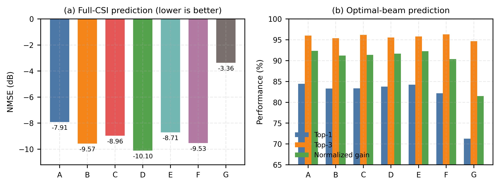
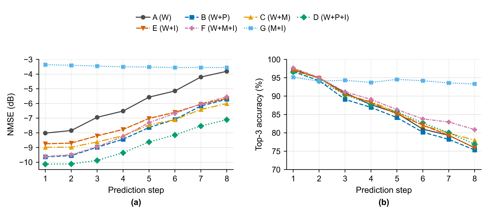

第二章：现有多模态信道预测工作都做了什么？

第三章：有哪些模态，它们分别能观测什么，以及如何对齐和融合？

第四章：面向具体通信任务，在什么条件下应该使用哪些模态，以及增加某种模态是否真的值得？

第五章：实际部署中的问题

还需要完成的：

* 重新训练波束（正在训练）

* 根据csi的结果先撰写第四章的部分。先把波束的内容空着或者先占位。

* 总之就是先根据目前的结果把第四章撰写完毕，并且波束的训练结果出来之后能根据结果快速补充撰写空着的部分。

* 然后撰写第五章问题和讨论，或者说开放的话题。

* 之后回去再次梳理前面几章，特别是第三章的论文总结和表格等等。

* 然后再撰写引言

后续再翻译成英文，调整字数，引文数量和完善其他细节

## II. 多模态无线预测研究现状

==信道预测通常利用已有无线观测中的时间相关性推断未来传播状态。然而，在高机动和动态环境中，未来信道不仅由过去的信道状态决定，还受到终端位移、阵列姿态以及遮挡物和散射体运动的共同影响。历史 CSI 记录了这些因素已经造成的传播结果，却未必能够在变化发生之前充分揭示其物理原因。==

### A. 面向 CSI 的多模态预测

现有面向 CSI 的多模态研究逐步将输入范围从无线侧相关信息扩展至终端运动状态和环境感知信息，以补充历史 CSI 对未来传播变化的有限可观测性。

* 文献[1]将历史下行 CSI、目标时刻上行 CSI 等无线信息与用户三维位置联合用于恢复目标时刻的完整下行 CSI，并比较了不同模态组合以及不同融合策略的性能差异。

* 在此基础上，运动学状态被用于增强未来 CSI 预测。文献[2]在毫米波车联网场景中，将近期阵列 CSI 与车辆协同感知消息中的位置、速度和加速度共同输入 LSTM 网络，预测下一采样时刻的阵列 CSI，并将预测结果用于前瞻性的波束管理。

位置、速度和加速度能够描述用户与基站之间的几何关系及其演化趋势，但主要反映终端自身运动，难以直接观察动态遮挡和散射环境的变化。为获得更丰富的环境信息，后续研究进一步将视觉感知引入 CSI 预测。

* 文献[3]及其扩展研究[4]提出射频—视觉联合的毫米波 CSI 预测框架：先从历史 RF 信道估计中预测未来多径的增益、相位和角度等参数，再利用基站 RGB 图像与预测路径参数间的跨模态注意力，识别终端、散射体和遮挡物相关区域以修正路径信息，并重建后续 CSI。

* 针对单节点感知易受视野遮挡限制的问题，文献[5]在 V2X 场景中将历史经 LS-LMMSE 获得的 CSI 与车辆和路侧单元采集的协同 LiDAR 点云相结合，用于预测未来的 MIMO-OFDM CSI。该方法先提取并融合多节点点云特征以形成更完整的环境表示，再结合历史 CSI 通过 GRU 进行时序预测；此外，其预测时域优化模块在预设误差约束下自适应确定预测结果的最长可用时长，从而减少导频重估计开销并提升有效吞吐量。

总体而言，面向 CSI 的多模态研究已从无线相关侧信息和低维终端状态，逐步扩展至局部视觉和协同三维环境感知。输入信息的扩展提高了模型对环境变化的可观测性，（但也带来了各种问题）

### B. 面向通信任务的直接预测

CSI 预测通常服务于波束选择、预编码和连接管理等后续操作。当系统只需要有限的任务相关信道特征时，另一类研究跳过完整 CSI 重建，直接预测角度、最优波束或阻塞状态，以便将预测结果直接映射为通信决策。

* 文献[6]将历史多径信道状态估计与 IMU 提供的运动及惯性测量联合输入 LSTM，预测未来路径角度等信道状态的概率分布，并据此自适应调整收发端后续的探测波束。该方法利用角速度与角加速度信息刻画终端旋转引起的快速到达角变化，从而降低波束跟踪中的探测开销并改善信道跟踪性能。

* 文献[7]面向 V2I 毫米波波束跟踪，利用 ResNet 从当前 LiDAR 点云或位置构成的场景空间矩阵中提取特征，并通过 LSTM 将其与最近已选波束序列融合，直接预测当前最优波束索引，以减少波束扫描和导频交换开销。

* 文献[8]针对低空无人机链路，考察了基站侧视觉、无人机 GPS 位置及高度、距离等遥测信息经注意力融合后对当前最优波束选择的作用，并利用 GRU 分别比较历史波束、位置序列和视觉序列对未来最多三个波束的预测能力。

除角度和波束预测外，另一类工作关注可能导致链路性能突降的阻塞事件。

* 文献[9]面向道路场景中的毫米波动态遮挡，采用双分支 CNN 将历史多波束接收功率与 LiDAR 点云序列进行融合，预测未来 LoS 链路是否阻塞，并进一步估计阻塞发生时刻、持续严重程度和遮挡物运动方向。

* 文献[10]则将基站侧连续 RGB 图像与用户历史最优波束序列联合用于未来链路阻塞预测：其先利用 YOLOv3 提取车辆等潜在遮挡物的位置特征，再通过 GRU 与波束序列进行时序融合；当服务链路被预测将阻塞而邻近基站链路仍保持视距时，系统据此提前发起切换。

与完整 CSI 回归相比，任务导向方法将信道演化压缩为角度、波束或阻塞状态等低维变量，使预测输出能够直接驱动波束调整、链路规避或基站切换。不过，这类输出通常只服务于预先定义的通信动作，难以替代完整 CSI 支持其他物理层功能。

### C. 代表性工作的统一比较

==表 I 从预测目标、无线侧输入、额外模态、融合方式及通信功能等方面对上述工作进行统一比较。==

**表 I  多模态无线预测代表性工作的比较**

| ==文献==   | ==预测目标==             | ==无线侧输入==                       | ==非无线模态==          | ==预测时域==                  | ==融合或预测方式==                 | ==服务的通信功能==         | ==场景与数据来源==              |
| -------- | -------------------- | ------------------------------- | ------------------ | ------------------------- | --------------------------- | ------------------- | ------------------------ |
| ==[1]==  | ==完整下行 CSI 获取/重建==   | ==历史下行 CSI、上行 CSI、导频、部分下行 CSI== | ==用户位置==           | ==主要面向当前相干周期；明确未来提前量未报告== | ==多输入分支的特征级融合==             | ==FDD CSI 获取与波束成形== | ==大规模 MIMO；仿真==          |
| ==[2]==  | ==下一采样位置的完整 CSI==    | ==当前及历史 CSI==                   | ==位置、速度、加速度==      | ==一步预测==                  | ==运动状态条件化的 LSTM 时序预测==      | ==预先波束管理==          | ==毫米波车联网；DeepMIMO/射线追踪== |
| ==[3]==  | ==后续路径参数及重建 CSI==    | ==历史 RF 信道估计、SSB 波束索引==         | ==RGB 图像==         | ==多个后续采样点；绝对时长未报告==       | ==路径参数预测与视觉修正==             | ==MRT 预编码与速率提升==    | ==室内毫米波；Unity 与统计信道仿真==  |
| ==[4]==  | ==后续完整 CSI==         | ==历史 RF CSI、SSB 波束索引==          | ==RGB 图像==         | ==近实时后续 CSI；使用目标时刻附近图像==  | ==Transformer 路径预测与跨模态注意力== | ==预编码与速率提升==        | ==毫米波大规模天线；Unity 与射线追踪== |
| ==[5]==  | ==后续 MIMO-OFDM CSI== | ==历史 LS-LMMSE CSI==             | ==多车辆/路侧协同 LiDAR== | ==多步预测，并动态选择可信时域==        | ==点云特征提取、协同感知融合与 GRU==      | ==导频开销控制与有效吞吐量提升==  | ==V2X；协同感知与信道仿真==        |
| ==[6]==  | ==AoA/AoD 分布及波束状态==  | ==历史角度/信道估计==                   | ==IMU 角速度、角加速度==   | ==一个波束传输周期==              | ==LSTM 预测与贝叶斯状态更新==         | ==探测波束选择与信道更新==     | ==毫米波移动终端；合成仿真==         |
| ==[7]==  | ==最优波束索引==           | ==历史波束信息==                      | ==LiDAR、GNSS==     | ==波束跟踪时域；绝对时长未报告==        | ==感知特征与波束历史联合学习==           | ==车路毫米波波束跟踪==       | ==V2I；公开数据集与仿真评估==       |
| ==[8]==  | ==当前及未来最优波束==        | ==历史最优波束==                      | ==RGB、GPS、高度、距离==  | ==最多三个后续样本==              | ==视觉或位置时序预测；当前任务包含多模态融合==   | ==UAV 毫米波波束选择与跟踪==  | ==60 GHz 无人机实测==         |
| ==[9]==  | ==阻塞时间、严重程度和方向==     | ==接收功率等带内特征==                   | ==LiDAR==          | ==动态阻塞提前预测；具体时间尺度随任务设置==  | ==LiDAR 与带内无线特征联合学习==       | ==主动阻塞规避与链路管理==     | ==毫米波动态链路；真实测量==         |
| ==[10]== | ==未来阻塞状态与切换决策==      | ==历史服务波束索引==                    | ==RGB 图像及目标检测结果==  | ==未来五个数据实例==              | ==视觉与波束特征融合后的 GRU 预测==      | ==主动基站切换==          | ==城市街区；ViWi 合成数据==       |

==基于这一研究图景，后续章节将进一步讨论不同模态能够观测的信道变化、面向低空 UAV 的模态选择以及实际融合所面临的关键问题。==

## III. 多模态信息、作用与融合机制

现有多模态研究所使用的信息可归纳为三类：以 CSI、路径参数、接收功率和历史波束为代表的**无线状态信息**，以位置、速度、加速度和 IMU 为代表的**运动状态信息**，以及以 RGB 图像和 LiDAR 点云为代表的**环境感知信息**。

### A. 无线状态信息：传播结果的直接观测

* 历史 CSI、接收功率和历史最优波束等无线状态信息直接记录了链路近期的传播状态。相邻时刻的信道通常具有较强的时间相关性，模型可以据此延续已有的幅度、相位和波束方向变化。在位置和运动信息的基础上加入近期 CSI，可以显著降低未来 CSI 的预测误差[2]；真实无人机链路实验也表明，历史最优波束对未来几个时刻的波束预测具有较高价值[8]。

* 然而仅凭历史无线序列，只能外推已经反映在观测数据中的变化。一方面，终端突然转向、加减速或改变姿态，会打破原有的角度和多普勒演化规律；新的车辆或行人进入关键传播路径，也会引入历史序列中尚未出现的遮挡过程。另一方面，相似的信道变化可能由不同物理事件造成。例如，接收功率下降可能来自终端转向、遮挡物进入视距路径或主导反射路径消失。历史无线序列难以区分这些变化的物理原因，也难以预见尚未作用于链路的突发事件。因此，还需要结合节点的运动状态和周围环境信息，判断信道可能发生的变化。

### B.运动状态信息：节点运动的外生先验

* 运动状态信息主要包括终端的位置、高度和相对距离等空间几何信息，速度、运动方向和加速度等平移状态，以及姿态角、角速度和角加速度等旋转状态。与图像和点云相比，它们维度较低，可以较高频率采集，存储和传输开销也较小。这些信息通常易于获取：GNSS 和导航系统可以提供位置、高度和速度，IMU 与控制系统可以测量或估计加速度、姿态和角运动状态，ISAC 还可通过无线感知估计相对距离、方位和径向速度，协同移动节点之间也可通过周期广播的协同感知消息（cooperative awareness message，CAM）共享相关运动状态[2]。

* 其中，位置、高度和距离反映收发端之间的空间关系，可以为传播距离、视距方向和候选波束范围提供几何约束。在固定场景中，位置还与周围建筑、道路和主要传播路径相对应，因此能够帮助模型学习不同区域的信道特征。在车辆 CSI 预测实验中，位置在位置、速度和加速度三种单项输入中提供了最明显的预测增益[2]。对于具有三维运动能力的无人机，平面位置并不足以完整描述其相对几何关系，进一步加入飞行高度和与基站的距离可以提高波束预测准确率[8]。不过，仅凭单个位置点无法判断终端下一时刻的运动方向，也无法描述天线朝向和外部环境变化。

* 速度、运动方向和加速度进一步描述终端位置随时间的变化。这些信息能够补充单个位置点缺少的时间趋势，但其预测能力仍取决于运动在短时间内具有一定连续性。在现有车辆 CSI 预测实验中，速度和加速度单独使用时的效果弱于位置，更适合作为位置和历史无线测量的补充[2]。

* 此外，终端即使没有明显位移，俯仰、横滚或偏航也会改变信号相对于阵列坐标系的入射方向，进而引起阵列响应和最优接收波束变化。IMU 提供的角速度和角加速度能够直接反映这种旋转趋势，可用于辅助预测未来到达角和出发角，且随着终端旋转速度增加带来的增益更加明显[6]。

* 然而，这类数据主要围绕通信终端本身，难以描述周围散射体和反射路径的变化。即使终端保持相同的位置、速度和姿态，外部遮挡物和散射体的变化仍可能导致不同的信道演化。为进一步刻画这些环境变化，还需要引入视觉和 LiDAR 等环境感知信息。

### C. 环境感知信息：传播场景的前瞻观测

* 环境感知信息主要描述通信链路周围物体的分布及其动态变化，包括相机采集的 RGB 图像、深度传感器或视觉算法获得的深度图，以及 LiDAR 生成的三维点云。与主要反映终端自身状态的运动信息不同，环境感知信息能够补充外部物体的语义、距离和三维结构，并通过不同时刻的观测刻画传播环境的变化。

* RGB 图像侧重描述环境的外观和语义，可以区分终端、车辆、行人和建筑物等不同对象，并提供其轮廓、相对位置和遮挡关系。由此，模型可以识别与通信链路相关的终端、遮挡物和潜在反射体，并从图像序列中提取其运动趋势，进而判断传播路径、波束方向和遮挡状态可能发生的变化。不过，RGB 图像不能直接给出准确的空间距离，其可靠性也容易受到光照、天气、视角和目标可见性的影响。

* 深度图侧重描述可见物体与相机之间的距离，为 RGB 图像补充尺度和空间位置信息。深度信息可以为传播路径的时延和角度提供几何约束，并间接辅助判断功率变化。由连续时刻采集的深度图构成的序列，还可以通过物体深度和轮廓的帧间变化，推断其接近或远离关键传播路径的趋势[11]–[13]。与点云相比，深度图通常更加稠密，并与 RGB 像素天然对齐，便于采用统一的视觉网络处理；但它主要描述当前视角下的可见表面，难以恢复被遮挡区域和完整的三维环境。

* LiDAR 点云侧重描述环境的三维几何结构，能够较准确地表示终端、遮挡物和周围建筑的空间位置、距离及轮廓。基于这些几何关系，可以约束可能的传播方向和候选波束范围，并判断物体是否位于或接近关键传播路径。对连续时刻采集的点云进行配准和关联后，还可以根据物体三维位置的帧间变化推断其运动趋势，从而预测遮挡的出现及后续演化。不过，点云通常稀疏且无序，需要经过滤噪、坐标对齐、体素化或专门的点云网络编码。

* RGB 图像、深度图和 LiDAR 点云均可通过多节点协同观测扩大覆盖范围，并缓解单一视角的遮挡。由于三类数据通常维度较高且结构复杂，实际系统更适合在数据源附近完成目标检测、特征提取或数据压缩，再共享压缩特征或目标级信息，而非直接传输原始感知数据。此外，这些信息主要反映物体的语义和空间结构，不能直接确定物体材料及其对无线信号产生的反射、绕射、穿透和相位影响。因此，环境感知信息更适合作为传播环境先验，与反映实际链路状态的无线信息互补，而不能完全替代无线测量。

### D. 多模态信息的对齐与融合

* 上述三类信息具有不同的采样频率、更新时延和数据结构，因而需要先围绕同一条通信链路、同一参考时刻和同一预测时域建立对应关系。时间上，可通过时间戳匹配、重采样、插值或滑动窗口，将CSI、运动状态和环境感知数据组织为相互对应的序列，同时记录各项信息的采集时刻及其到达预测端的时延。空间对齐的要求则取决于后续融合方式：若各模态经过独立编码后仅在全局特征层组合，则无需建立原始数据之间的逐点对应；若需要利用波束或路径方向在图像和点云中定位相关终端、遮挡物和反射区域，或需要融合多个节点的环境观测，则应通过传感器标定和位姿变换建立显式的空间关联。经过对齐后，各模态被转换为描述当前传播状态、终端运动趋势和环境变化的关联特征。

* 融合则应围绕信道的形成和演化过程展开。对于结构简单且已同步的CSI与运动状态，可以直接组合后进行时序建模；对于图像、点云和无线序列等差异较大的数据，更适合先采用独立编码器提取特征，再在传播状态层进行融合。当各模态的可靠性随测量质量和预测时域变化时，可以通过可靠性加权或门控动态调整其贡献；当需要从高维环境感知中提取与特定波束或传播路径相关的信息时，则可将无线侧预测的路径参数作为查询，通过跨模态注意力选择相应的图像或点云区域，并利用其中的环境信息修正路径状态。因此，融合层次和机制应由不同模态与预测目标之间的物理关系决定。

## Ⅳ. 多模态信息的任务价值与适用边界

多模态预测的关键并非输入越多越好，而是新增模态能否为具体通信任务补充历史无线观测中缺失的信息。本节以完整 CSI 重建和最优波束预测为代表任务，在统一的模型框架和数据划分下比较不同模态组合，并进一步分析其在直接预测和递归预测中的作用。

### A. 实验配置

实验数据由 SimART 及其扩展的数据生成流程构建。在固定城市地图和 9 个基站配置下，共生成 200 条经过碰撞检测的平滑无人机轨迹；每条轨迹持续 10 s，飞行速度为 5–10 m/s，高度为 35–50 m。无线信道由扩展后的 SimART 射线追踪模块生成，基站视角图像和无人机运动状态由同步运行的 AirSim 场景记录。各模态沿同一轨迹按时间戳对齐，完整轨迹按 8∶1∶1 划分为训练集、验证集和测试集。

每个基站—无人机链路的对齐数据包括复数 CSI、64 个候选波束的增益及最优波束索引、无人机三维位置、线速度、四元数姿态和对应基站视角的 RGB 图像。载频为 3.5 GHz，基站采用 8×8 UPA，CSI 包含 128 个子载波，子载波间隔为 30 kHz。CSI、运动状态和 RGB 的原始采样率均为 20 Hz；波束任务从对齐序列中按固定间隔取样为 5 Hz。

表 II 列出了用于比较的七种输入组合。

**表 II  实验中的模态组合**

| 组合 | 历史无线观测 W | 三维位置 P | 线速度与姿态 | RGB 图像 I |
| ---- | -------------- | ---------- | ------------ | ---------- |
| A    | ✓              | —          | —            | —          |
| B    | ✓              | ✓          | —            | —          |
| C    | ✓              | ✓          | ✓            | —          |
| D    | ✓              | ✓          | —            | ✓          |
| E    | ✓              | —          | —            | ✓          |
| F    | ✓              | ✓          | ✓            | ✓          |
| G    | —              | ✓          | ✓            | ✓          |

注：历史无线观测 W 在 CSI 任务中表示历史 CSI，在波束任务中表示历史最优波束。

为保证公平比较，同一任务的七种组合采用相同的特征维度、融合模块和预测解码器，仅启用的输入分支不同。CSI 分支通过并行卷积网络分别提取天线—频率域和角度—时延域特征，并利用自适应门控融合双域表示；波束分支将历史波束索引映射为可学习的嵌入；位置和完整运动状态通过傅里叶特征映射与多层感知机编码；RGB 序列由预训练 ConvNeXt-Tiny 提取视觉特征。空间和时间 Transformer 首先建模各模态内部的结构与演化，随后由跨模态 Transformer 融合不同特征序列。融合结果经过结构一致的 Transformer 解码器，最终由任务相关输出层重建未来完整 CSI 或生成 64 个候选波束的预测分布。

### B. 直接预测中的模态贡献

为量化不同模态对直接预测的贡献，模型利用历史 8 个采样点一次性预测后续 2 个采样点。CSI 样本由互不重叠的连续窗口构造，波束样本则在 5 Hz 序列上采用固定步长滑窗，以覆盖足够的波束切换过程。同一任务的所有模态组合共享相同的样本窗口和数据划分。CSI NMSE 根据两个预测步的累计误差能量与信号能量计算；波束 Top-1、Top-3 和归一化波束增益在两个预测步的全部目标帧上统一统计。

如图 1(a) 所示，仅使用历史 CSI 的 A 达到 −7.91 dB。引入位置的 B 和引入 RGB 的 E 分别达到 −9.57 dB 和 −8.71 dB，表明显式几何信息在当前场景中提供的增益大于单独视觉信息。联合位置与 RGB 的 D 达到最佳的 −10.10 dB，相比 A 改善 2.19 dB，进一步体现了几何先验与场景观测的互补性。

完整运动状态并未带来进一步改善：C 和 F 分别为 −8.96 dB 和 −9.53 dB，均低于对应的 B 和 D。由于本实验中的飞行轨迹较为平滑，连续位置已经隐含了主要运动趋势，额外的速度和姿态可能形成信息冗余并增加融合难度。不包含历史 CSI 的 G 仅达到 −3.36 dB，说明运动与图像可以约束信道的空间分布，但不足以替代近期无线观测来恢复完整复数 CSI。

波束预测呈现出不同的模态作用，如图 1(b) 所示。仅使用历史波束的 A 获得 84.45% 的 Top-1；引入位置、运动状态或 RGB 后，B–F 均未超过 A，其中最接近的 E 为 84.22%。这表明近期无线观测已经包含较强的波束延续信息，附加模态没有进一步改善两个预测步内的精确波束选择。

候选波束覆盖呈现出另一种趋势。结合运动状态和 RGB 的 F 获得最高的 96.31% Top-3，而 A 为 96.03%。G 在缺少历史波束时的 Top-1 降至 71.28%，但 Top-3 仍达到 94.67%；其归一化波束增益为 81.48%，低于 A 的 92.35%。这些结果表明，运动和视觉能够确定较准确的候选波束范围，但近期无线观测对于从候选集合中识别唯一最优波束仍然关键。

总体而言，新增模态的价值取决于预测目标。完整 CSI 包含幅度、相位和空间结构，位置与视觉能够补充历史 CSI 未显式表达的传播条件；最优波束则将信道压缩为离散决策，近期波束历史已为较近预测步提供强先验，附加模态的作用更多体现为缩小候选范围。与此同时，连续位置已经描述了平滑轨迹中的主要运动趋势，因此增加速度和姿态并不必然带来额外收益。

**图 1：不同模态组合的直接两步预测性能。** (a) 两个预测步联合统计的完整 CSI 预测 NMSE；(b) 两个预测步联合统计的最优波束预测 Top-1、Top-3 和归一化波束增益。

### C. 递归预测中的误差积累

为评估预测误差在连续决策中的累积，模型以 8 个真实采样点作为初始历史，每轮预测后续 2 个采样点，并将预测的 CSI 或波束索引回填至无线历史；连续执行四轮后得到未来 8 步结果。位置、速度、姿态和 RGB 在每轮均采用对应预测步新获得的观测。由于 G 不包含无线输入，其结果反映持续外部观测所能提供的预测能力；其余组合则用于衡量辅助模态在无线历史逐渐被预测值替代时能否抑制性能退化。

CSI 结果如图 2(a) 所示。随着预测步数增加，所有包含历史 CSI 的组合均受到回填误差累积的影响。A 从第 1 步的 −8.00 dB 下降到第 8 步的 −3.63 dB；D 则从 −10.11 dB 下降到 −7.01 dB，并在全部预测步上保持最佳。D 相对 A 的优势由第 1 步的 2.11 dB 扩大到第 8 步的 3.38 dB，说明位置与 RGB 能够为逐渐失真的无线历史提供独立参照。

视觉信息的相对价值也随预测步数增加：E 相对 A 的增益由第 1 步的 0.73 dB 增至第 8 步的 1.93 dB。G 不使用预测 CSI 作为后续输入，其 NMSE 始终约为 −3.5 dB，表现出较稳定但明显受限的性能。这进一步说明，外部模态可以缓解递归误差累积，但近期无线观测仍决定完整 CSI 重建的性能上限。

对于波束任务，不同组合的候选覆盖能力随预测步数呈现出明显差异，如图 2(b) 所示。A 的 Top-3 从第 1 步的 97.16% 降至第 8 步的 75.48%，B、D 和 E 呈现相近的下降趋势。相比之下，持续利用运动和视觉观测的 G 从第 1 步的 95.23% 变化至第 8 步的 93.53%，并从第 3 步开始超过其他组合。第 8 步时，G 的归一化波束增益为 79.26%，而 A 已下降至 55.97%。因此，近期无线观测更有利于较近预测步的精确选择，持续更新的运动和视觉观测则更有利于在递归预测中维持候选波束范围。

**图 2：不同模态组合的递归预测性能。** (a) CSI NMSE 随预测步数的变化；(b) 波束 Top-3 随预测步数的变化。

两项任务共同表明，模态价值由预测目标和预测步数共同决定。完整 CSI 重建受益于位置与 RGB 提供的几何和场景先验；最优波束预测在较近预测步主要依赖无线历史，外部模态的优势则更多体现在候选范围约束。随着预测无线状态被反复回填，持续更新的运动和视觉观测能够提供独立参照，并在较远预测步上体现更高价值。因此，模态选择应同时考虑通信任务、预测步数以及运行时可获得的外部观测，而不能仅由输入数量决定。

## Ⅴ. 问题和讨论

前述实验表明，多模态信息的价值并非常数：它取决于预测任务、预测时域、传播状态以及辅助模态是否真正观测到变化原因。实际系统因而不能只部署一个始终启用全部输入的固定预测器。进一步从离线精度走向在线通信决策，还需要解决以下问题。

### A. 从固定融合到可靠性感知的动态选择

固定融合默认所有模态在每个时刻都可用且同样可信，但这一假设在真实网络中通常不成立。GNSS 会受到城市峡谷和非视距传播影响，RGB 会因光照、天气和遮挡退化，历史 CSI 也会随着预测时域增长而逐渐失效。更重要的是，某种模态即使测量准确，也不一定与当前预测目标有关。例如，本章实验中位置和 RGB 对稳定 CSI 的帮助明显大于对快速变化 CSI 的帮助，完整运动状态也没有稳定优于单独位置。这说明模态选择不应仅依据“是否能够采集”，而应依据其对当前任务的可观测性和预期增量。

一种可行方向是将预测器扩展为“状态评估—模态选择—结果校验”的闭环。系统首先根据历史 CSI 变化、各模态新鲜度和质量、预测置信度及当前通信任务，选择无线、位置、运动或视觉分支；随后决定预测提前量和是否需要调用高开销编码器；如果输出置信度不足，则缩短预测时域，触发新的信道估计、候选波束扫描或切换到稳健策略。该过程可以由轻量门控网络实现，也可以表述为受时延、能耗和可靠性约束的序贯决策问题，由 Agent 在多个预测模型、模态组合和通信动作之间选择。这里 Agent 的作用不是替代信道模型，而是根据上下文管理何时预测、预测多远、调用哪些信息以及何时放弃预测。

### B. 异步、缺失与不确定模态

无线、运动和视觉传感器通常具有不同采样率、传输时延和处理流水线。仅在数据集构建阶段把它们重采样到同一时间轴，并不能消除在线系统中的信息陈旧问题：一张时间戳较早但刚完成编码的图像，可能比一条最新位置消息更晚到达预测端；丢帧和网络拥塞还会使不同模态的有效历史长度不断变化。因此，模型除接收观测值外，还应显式接收采集时间、到达时间、缺失掩码和质量指标，并采用异步时序编码或时间差嵌入，而不是把填充或插值后的数据当成同步真值。

输出端同样需要从点预测扩展到不确定性估计。模型可以给出 CSI 误差尺度、候选波束概率或预测有效时域，并对分布外环境、模态缺失和冲突观测进行校准。当不同模态给出不一致证据时，系统应降低预测置信度，而不是强制融合。面向实际控制，判断“当前预测是否仍可使用”与提高平均 NMSE 或 Top-1 同样重要。

### C. 端到端时延和资源开销

预测精度只描述算法收益的一部分。高维 RGB 和 LiDAR 的代价来自传感器采集、前处理、特征编码、网络传输和跨模态融合，而不仅是神经网络前向传播。现有原型已经报告毫秒级推理时间，例如文献[8]中的多模态波束预测约为 6.83 ms/次，文献[4]中的完整预测与后续更新约为 3.2 ms 和 1.6 ms；但这些数值依赖硬件、输入尺寸、批量大小和计时边界，不能直接代表端到端部署时延。

因此，后续评价应同时报告预测性能、模型参数量、计算量、峰值显存、单样本时延以及传感与传输开销，并使用“单位额外开销带来的任务增益”比较模态。对于固定基站相机，可在源端提取并缓存场景特征，只传输与链路相关的目标级或区域级表示；对于短时且稳定的链路，可跳过视觉分支；只有当无线历史老化、切换风险升高或长时预测确有需要时，再调用高开销模态。事件触发、特征缓存、早退网络和模型蒸馏均可降低持续运行成本。

### D. 泛化、标定与仿真到真实环境

位置和视觉在固定城市地图中能够学习稳定的空间映射，但也可能使模型依赖特定建筑布局、基站位置、相机视角和射线追踪参数。部署到新地图、新频段或不同阵列时，材料电磁属性、天气与光照、相机内外参误差以及天线方向图偏差都会造成分布迁移。当前实验按完整轨迹划分数据，能够避免同轨迹泄漏，但训练和测试仍来自同一城市及同一组基站，尚不能证明跨场景泛化能力。

后续数据与评价应增加跨地图、跨基站、跨频段和跨天气划分，并利用少量实测数据校准仿真模型。将坐标变换、阵列响应和传播约束显式嵌入模型，有助于减少对单一场景纹理的依赖；域随机化、自监督适配和持续学习则可用于处理实际环境变化。与此同时，位置和图像还涉及隐私、访问权限和潜在攻击面，模型需要对伪造位置、遮挡相机和异常无线输入具备检测与安全回退机制。

### E. 从预测指标到通信效用

NMSE、Top-1 和 Top-k 是便于比较的离线指标，但不完全等价于最终通信收益。较小的 CSI 误差未必总能提高频谱效率，而一次 Top-1 错误也可能仍选择到增益接近最优的相邻波束。未来工作应将预测输出接入预编码、波束扫描、链路切换和导频调度，进一步评价可达速率、失效率、波束训练开销和能效。对于完整 CSI，应关注误差对下游预编码与速率的影响；对于波束任务，则应联合考察 Top-k 候选集合、归一化波束增益及切换事件上的可靠性。

综上，实际多模态无线预测系统应由“固定模型、固定模态、固定时域”转向任务驱动和可靠性感知的闭环：根据当前传播状态与系统资源选择模态，根据不确定性调整预测时域，并在预测收益不足时及时回到信道测量或波束扫描。这样的自适应机制也是连接多模态感知、学习预测与智能网络控制的关键开放方向。

[11] T. Nishio, H. Okamoto, K. Nakashima, et al., “Proactive Received Power Prediction Using Machine Learning and Depth Images for mmWave Networks,” IEEE Journal on Selected Areas in Communications, vol. 37, no. 11, pp. 2413–2427, Nov. 2019.

[12] S. Ayvaşık, F. Mehmeti, E. Babaians, and W. Kellerer, “PEACH: Proactive and Environment-Aware Channel State Information Prediction with Depth Images,” Proceedings of the ACM on Measurement and Analysis of Computing Systems, vol. 7, no. 1, Article 24, Mar. 2023.

[13] Z. Zeng, S. Sun, M. Tao, Z. Chen, J. Mo, and X. Gu, “Low-Altitude Channel Multipath Prediction via Panoramic Perception and Vision-Language Model,” arXiv:2607.21953v1, Jul. 2026.
